# 6.3 Lesson Plan - Bank Deserts

## Overview

In this class, students will be introduced to the Google Maps and Places API as well as Jupyter Gmaps. Using these new tools, along with data from the US Census, students will be tasked with creating visualizations to capture the socioeconomic trend of [banking deserts](http://www.theatlantic.com/business/archive/2016/03/banking-desert-ny-fed/473436/).

### Instructor Notes

* Today's class is a fun one! In this class, students take on the role of social scientists and are tasked with using their newfound programming skills and API insights to visualize a real-world phenomenon: banking deserts.

* What _is_ a banking desert? In predominantly lower-income or elderly neighborhoods, there is often a dearth of banks. In their place is an abundance of high-interest "check-cashing" and "money transfer" providers. These shifty providers benefit from the fact that banks avoid such neighborhoods, leaving residents with few safe options to obtain cash, loans, or withdrawal services. To showcase this trend, students will use a dataset obtained from the US census that lists the socioeconomic factors (population, median age, household income, poverty rate, etc.) of each zip code in the country. They will then need to create code that randomly selects 700 zip codes and uses Google Places to identify the number of banks present within a 5 mile radius of that zip code. Finally, they will plot the relationship between "bank count" and  socioeconomic factors.

* Leading up to this exercise, you as Instructors and TAs will be responsible for teaching students how to correctly use the Google Geocoding and Places APIs — along with how to use them in combination. Today's class is also important, because these APIs will be useful tools in students' upcoming projects.

* Have your TAs reference the [6.3-TimeTracker](TimeTracker.xlsx) to help keep track of time during class.

* **Note**:  The API keys used throughout this lesson have been disabled and will have to be replaced with active keys.

### Sample Class Video (Highly Recommended)

* To view an example class lecture visit (Note video may not reflect latest lesson plan):

[Class Video 1](https://codingbootcamp.hosted.panopto.com/Panopto/Pages/Viewer.aspx?id=e4a7ada4-6e5a-4a60-a43a-adb36a65a380)

[Class Video 2](https://codingbootcamp.hosted.panopto.com/Panopto/Pages/Viewer.aspx?id=2c57d896-8c1d-4167-988f-df8ac4441b03)

- - -

### Class Objectives

* Students will be able to successfully use the Google Maps and Places API to obtain information about geographic areas.

* Students will understand how to use the Census API wrapper.

* Students will understand the concept of rate limits and the importance of creating "test cases" prior to running large scripts.

* Students will have a firmer understanding of how to dissect new API documentation.

* Students will be able to visually represent data on a map with Jupyter Gmaps.

- - -

### 1. Everyone Do: Demonstrate Google Maps / Places (0:15)

* Explain to students that, for the remainder of class, they will be working with the Google Maps and Places API. Let them know that this section is critical and may confuse them if they lose focus.

* Begin your discussion by opening the URL for the [Google Maps API](https://developers.google.com/maps/) and [Google Places API](https://developers.google.com/places/).

  * Google has made available some of the vast set of tools that power Google Maps, such that any developer can utilize the same technologies and datasets in their own applications.

  * At a basic level, these APIs allow developers to quickly convert locations into latitudinal and longitudinal coordinates, identify nearest restaurants to a given location, determine the distance between two points, and much more!

* For the purposes of today's class, students will ultimately be using the data from Google Maps and Places to determine the number of banks in a given zip code and then compare those counts to socioeconomic factors associated with zip code.

* Once students have the picture in mind, show them how they can go about obtaining their own API key.

  * Start off by clicking the `Get Started` button on the [Google Maps Platform](https://cloud.google.com/maps-platform/) webpage.

  * Select the boxes for the `Maps` and `Places` products.

  * At this point, click Create a New Project and give the project a name. Once that has been done, click Create Billing Account. Explain that while Google now charges for services, a $200 credit is provided for these API services.

  * Warn students that any API usage beyond the $200 credit will be charged to their personal accounts. Slack out a link to Google's billing page as a reference, and explain that API usage limits and billing alerts can be setup so that the free credit is not exceeded.

    * Navigate through the Acceptances to try the cloud platform, then complete the next form to establish a Google Cloud Platform account.

    * The following windows will automatically enable the Google Maps Platform. Once complete, a window containing a unique API key will appear. Copy this key for use in Python.

  * Slack out the [Capping Queries](Activities/Resources/Capping_Queries.md) document to set query limits for API usage.

    * You can begin following the document from step 3 if you have not navigated away from your list of active APIs.

    

### 2. Instructor Do: Google Geocode (0:15)

* Now that everyone has an API Key (Congratulations!), it is time to start using it!

* To begin, show students how to utilize the Google Maps Geocoding API to turn addresses into latitudinal and longitudinal coordinates.

  * This process of converting an address to coordinates is called **geocoding**.

  * Since many APIs only understand locations formatted in terms of latitude/longitude, geocoding will be very valuable in translating addresses into data that APIs - like the Google Places API - can understand.

* At this point, either open [02-Ins_Google_Geocode/Google_Geocode.ipynb](Activities/01-Ins_Google_Geocode/Solved/Google_Geocode.ipynb) in Jupyter Notebook explaining the code in sequence or live-code the script.

  * Utilize the API key from  `config.py`.

    * Google's API is not free and if credit card information is provided, they charge past a certain usage point. Here is a good time to again stress to students that they avoid pushing their API key to github by using adding the `config.py` to their `.gitignore` file or using environment variables.

  * Build the endpoint URL.

    * Remind students that printing the url will also expose their key. While it is useful for demonstration purposes here, it should be avoided in projects and homework.

  * Run a Python request on the URL.

  * Explore the resulting JSON in a pretty printed format.

  * Extract the components of the JSON we desire.

  * Format the results for printing.

    * This may be the first time students have seen string formatting using %s. Explain to them that `%s` can be used to substitute a string variable. After closing the quotations, the expression must be followed by `%` and then a tuple of string variables to be substituted respectively into each occurrence of `%s`.

    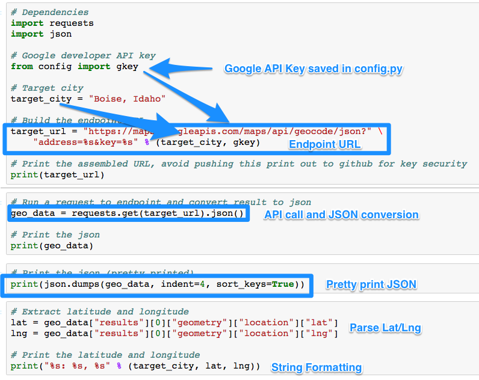

* Once complete, take a moment to visit the [Google Maps Geocoding API](https://developers.google.com/maps/documentation/geocoding/start) documentation page and show students that the code created is effectively the same as what's expressed in the documentation.

  * Let them know that it's easy to be intimidated by code documentation but with a little practice it becomes simple to comprehend.

### 3. Instructor Do: Google Places  (0:15)

* Now open up the [Google Places API](https://developers.google.com/maps/documentation/javascript/places#place_searches) and take a moment to walk students through the documentation for a bit.

  * In essence, the points to emphasize are: [Nearby Search](https://developers.google.com/places/web-service/search#PlaceSearchRequests), [Text Search](https://developers.google.com/places/web-service/search#TextSearchRequests), and [Place Search](https://developers.google.com/places/web-service/search#RadarSearchRequests).

  * When talking about Nearby Search, point out the inputs (Lat/Lng, Radius) and the various optional parameters including: keyword, minPrice, maxPrice, type, etc.

  * It may also be beneficial to point out the various [types](https://developers.google.com/places/supported_types) Google categorizes by default. Students will be using the "bank" type later in the day when they start creating visualizations for Banking Deserts.

* Once students have a decent enough understanding of the API, open up [03-Ins_Google_Places/Google_Places.ipynb](Activities/02-Ins_Google_Places/Solved/Google_Places.ipynb) in Jupyter Notebook and explain the code.

  * For the most part, the code is similar to the earlier example. The base URL, however, has changed since the class is now using the Google Place Search API.

  * In this example, we are using a feature of the [requests library](http://docs.python-requests.org/en/master/user/quickstart/#passing-parameters-in-urls) in order to easily construct our url by passing in a dictionary of parameters.

  * During the discussion of this example, point out the various URL parameters like `keyword`, `location`, and `types`. Also point out the different JSON structure that is provided back to the user.

    

### 4. Students Do: Google Drills (0:15)

* The class will now create some code that makes calls to both the Google Places and Google Geocoding APIs.

* Slack out the starter file for [04-Stu_Google_Drills/Google_That.ipynb](Activities/03-Stu_Google_Drills/Unsolved/Google_That.ipynb) and open in Jupyter Notebook in order to explain the instructions to students.

* **File:**

  * [04-Stu_Google_Drills/Google_That.ipynb](Activities/03-Stu_Google_Drills/Unsolved/Google_That.ipynb)

* **Instructions:** [04-Stu_Google_Drills/README.md](Activities/03-Stu_Google_Drills/README.md)

  * Complete each of the six drills articulated in the code provided. Feel encouraged to look back at the previous examples but know that you will have to consult the Google API documentation.

* **Hints:**

  * See the [Google Geocoding Documentation](https://developers.google.com/maps/documentation/geocoding/intro)

  * See the [Google Places Documentation](https://developers.google.com/maps/documentation/javascript/places#place_search_requests)

### 5. Instructor Do: Google Drills Review (0:05)

* Open up [04-Stu_Google_Drills/Google_That.ipynb](Activities/03-Stu_Google_Drills/Solved/Google_That.ipynb) within Jupyter Notebook and run through the code with the class line-by-line, making certain to hit upon the following points.

  * For the most part, the solution to these drills are self-explanatory. The only notable differences are that, in the last two drills, students would need to use a "Keyword Search" and a "Text Search". Both of these search types are articulated in the Google Places documentation.

  * Keyword Search

    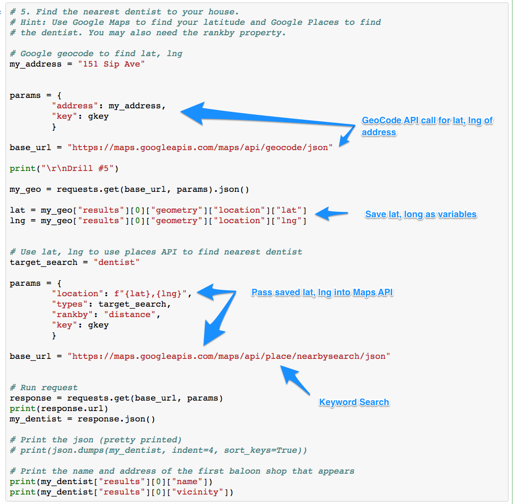

  * Text Search

    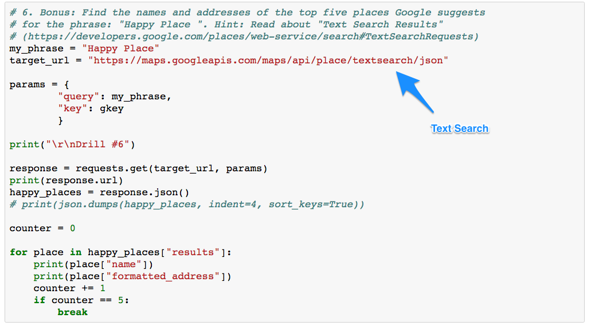

### 6. Instructor Do: Nearest Restaurants (0:05)

* Previously, student have only done iterative API requests from a list of targets. In this activity, pandas's `iterrows()` and `.loc` methods are used to find the closest restaurant of each type and store them in a data frame.

* Open [05-Ins_NearestRestr/NearestRestr.ipynb](Activities/04-Ins_NearestRestr/Solved/NearestRestr.ipynb) and explain the code to students while highlighting the following:

  * Set up empty columns to for values retrieved from API.

    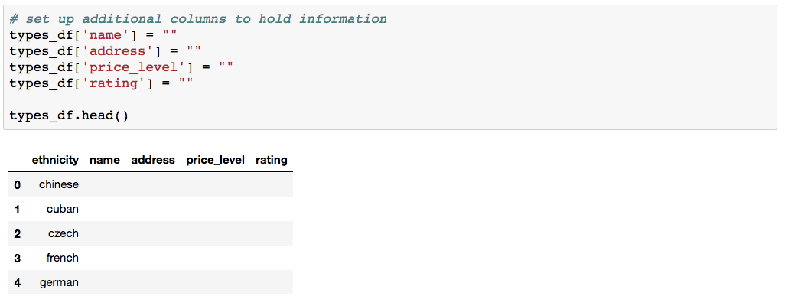

  * `iterrows()` iterates through each row of the dataframe returning an index number and the contents of each row. Those row values can then be individually accessed using the column label like so `row['column label']`.

  * In each iteration, the `keyword` value is overwritten to be the new target.

  * Instead of using `try/except` , we use `.get()` to retrieve `results` if it exists. If if does not, the `results` variable returns as `None` by default.

  * If `results` is not `None`, then the if statement is triggered.

  * `.loc` is used to update the cells with the desired information from the results. This time, however, we give the `.get()` method a second parameter, which will override the default of returning `None`, and instead return an empty string. This allows us to get the information that is available even if some keys are missing.

  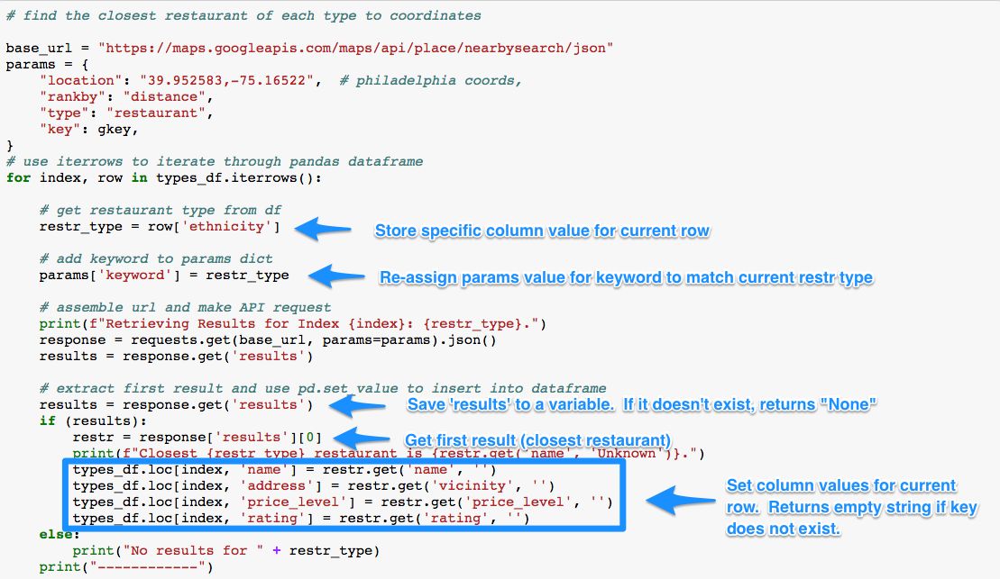
  

### 7. Partners Do: Google Complex (Airport) (0:20)

* Next, open up the solved version [06-Stu_Google_Complex/Airport_Ratings.ipynb](Activities/05-Stu_Google_Complex/Solved/Airport_Ratings.ipynb) and show students the ending Data Frame.

  * Explain to students that in this activity, they will be tasked with obtaining the rating of every airport in the top 100 metropolitan areas according to Google Users. They will be given a list of airports and cities, and will need to use the Google Geocoding API and Google Places API to obtain the rating information.

  

* **Files:**

  * [06-Stu_Google_Complex/Airport_Ratings.ipynb](Activities/05-Stu_Google_Complex/Unsolved/Airport_Ratings.ipynb)

  * [06-Stu_Google_Complex/Cities.csv](Activities/05-Stu_Google_Complex/Resources/Cities.csv)

* **Instructions:** [06-Stu_Google_Complex/README.md](Activities/05-Stu_Google_Complex/README.md)

  * Using [06-Stu_Google_Complex/Airport_Ratings.ipynb](Activities/05-Stu_Google_Complex/Unsolved/Airport_Ratings.ipynb) as a starting point, utilize the Google Geocoding API, the Google Places API, and Python/Jupyter, create a script that lists the "Airport Rating" of the major "International Airport" in each the top 100 metropolitan areas found in [06-Stu_Google_Complex/Cities.csv](Activities/05-Stu_Google_Complex/Resources/Cities.csv).

  * Your final `ipynb` file should contain each of the following headers:

    1. `City`

    2. `State`

    3. `Lat`

    4. `Lng`

    5. `Airport Name`

    6. `Airport Address`

    7. `Airport Rating`

* **Hints:**

  * You will need to obtain the lat/lng of each airport prior to sending it through the Google Places API to obtain the rating.

  * When using the Google Places API, be sure to use the term: "International Airport" to ensure that the airport you receive data for is the major airport in the city and not a regional one.

  * Use a try-except to skip airports for which there are no Google user ratings.

### 8. Instructor Do: Review Google Complex (Airport) (0:05)

* Open up [06-Stu_Google_Complex/Airport_Ratings.ipynb](Activities/05-Stu_Google_Complex/Solved/Airport_Ratings.ipynb) within Jupyter Notebook and run through the code with the class line-by-line, making certain to hit upon the following points.

  * `iterrows()` is used to loop through each city in the DataFrame to obtain the geo-coordinates for each airport.

  * `.loc` sets the value of lat/lng columns to match the retrieved coordinates that Google Geocoder API provides.

    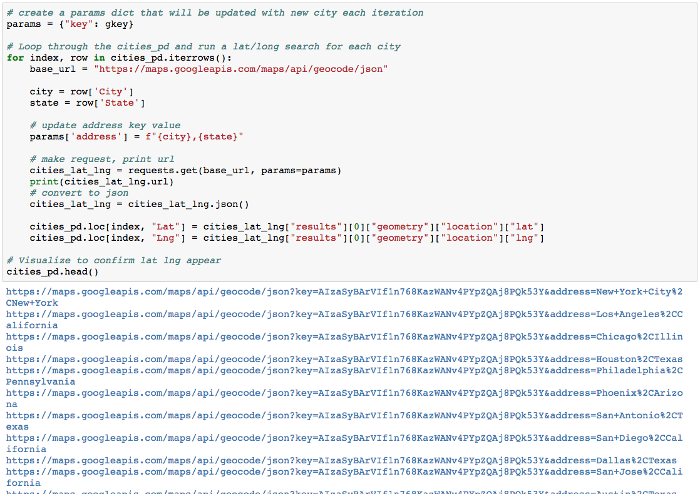

    

  * The iteration is repeated a second time utilizing the newfound lat/lng to obtain the airport information according to Google Places.

  * Also, point out that the application uses a try-except block to avoid situations where Google Places is missing review information.

    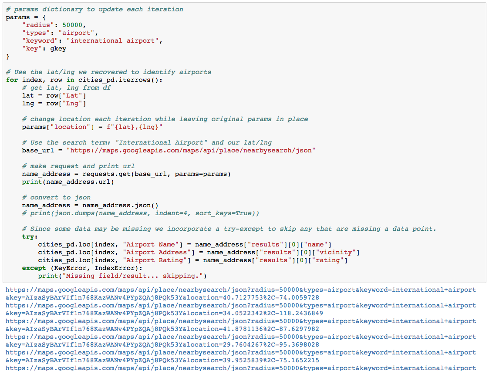

    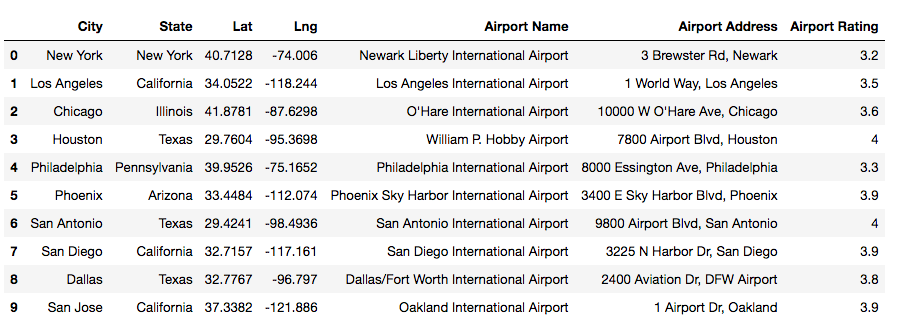

- - -

### 9. Break (0:40)

- - -

### 10. Everyone Do: Jupyter gmaps (0:15)

* Upon returning to class, explain the use-case for [Jupyter gmaps](http://jupyter-gmaps.readthedocs.io/en/latest/tutorial.html). While discussing Jupyter Gmaps, be sure to explain:

  * _gmaps_ is a plugin for Jupyter, allowing users to embed Google maps directly into their notebooks.

  * This grants the ability to visualize multiple layers of data as well as customize the appearance of the map.

* Before beginning the installation:

  * First revisit the steps to enable a google API.

  * Direct the students to return to the [Google API Console](https://console.developers.google.com/) and ensure the project created earlier is selected.

    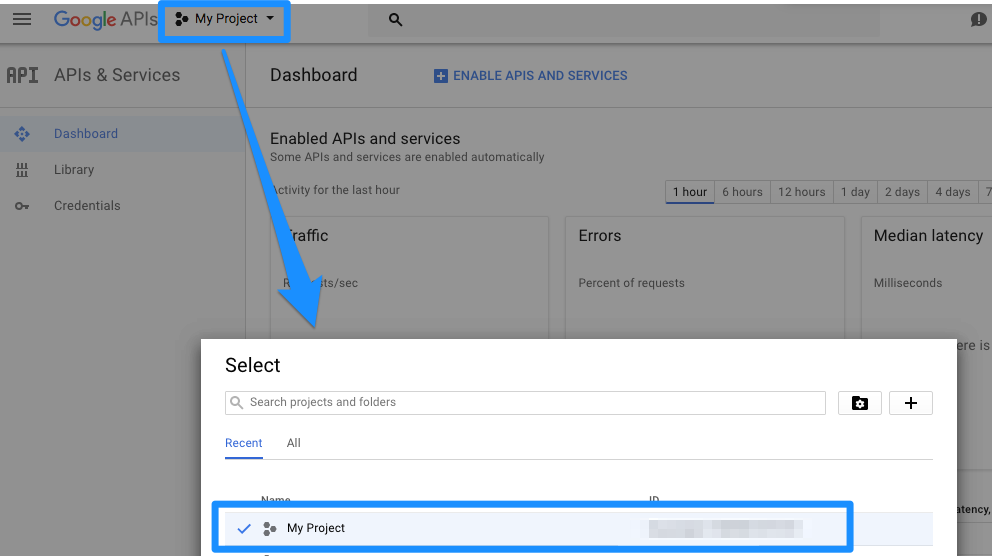

  * Click the library on the side panel and search for _Maps JavaScript API_.

  * Direct the students to enable the API.

* Once the API is ready for use, install by running `conda install -c conda-forge gmaps` in their virtual environment.

* Before moving on to the demonstration, address questions and troubleshoot any installation issues.

* Once all students have their API keys and tools installed, slack out the notebook file [gmap.ipynb](Activities/06-Evr_Jupyter_Gmaps/Unsolved/gmaps.ipynb). Live code and explain along the way:

  * Configuring gmaps by passing in their unique API key.

  * Building a base map. Explain to the students that this is the first building block when creating visualizations with gmaps.

  ```python
  import gmaps
  from config import gkey

  gmaps.configure(api_key=gkey)

  fig = gmaps.figure()
  ```

  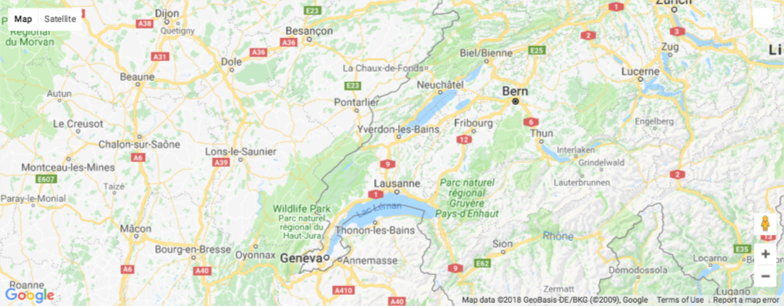

  * **Note**: some students may encounter an error with Jupyter Widgets when displaying the first figure. Reference the [Jupyter Widget documentation](http://ipywidgets.readthedocs.io/en/latest/user_install.html) for additional instructions.

  * Adding layers to the map. Demonstrate a `marker_layer` by creating a list of tuples in the kernel. Each tuple is a coordinate for a US city.

  ```python
  coordinates = [
      (40.71, -74.00),
      (30.26, -97.74),
      (46.87, -96.78),
      (47.60, -122.33),
      (32.71, -117.16)
  ]

  fig = gmaps.figure()
  markers = gmaps.marker_layer(marker_locations)
  fig.add_layer(markers)
  fig
  ```

  * Adjusting the viewport. Note how the map automatically adjusts the view as data is added. The zoom and map center and be manually adjusted within `gmaps.figure()`, though both parameters must be met to apply the adjustment.

  * Explain that the figure can also be centered within the user's output cell by setting the left and right margins to auto:

  ```python
  figure_layout = {'width': '400px', 'margin': '0 auto 0 auto'}

  gmaps.figure(layout=figure_layout)
  ```

  * Next, demonstrate map customization by adding width and height attributes. Margin and padding can also be specified.

  ```python
  import gmaps
  gmaps.configure(api_key="your_key")

  figure_layout = {
    'width': '400px',
    'width': '300px',
    'border': '1px solid black',
    'padding': '1px'
  }

  fig = gmaps.figure(layout=figure_layout)
  fig
  ```

  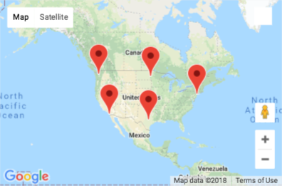

* Finally, demonstrate exporting the completed figure as a .png file via the download button.

  

* Discuss that gmaps accepts coordinates from several different forms: the list of tuples as demonstrated, a dictionary of lists, and from a dataframe containing a column each for latitude and longitude.

### 11. Student Do: Hot Airports (0:15)

* **Files:**

* [08-Stu_Airport_Map/Airport_Output.csv](Activities/07-Stu_Airport_Map/Resources/Airport_Output.csv)

* [08-Stu_Airport_Map/airport_heatmap.ipynb](Activities/07-Stu_Airport_Map/Unsolved/airport_heatmap.ipynb)

* **Instructions**

* Using the airport CSV from earlier, create a heatmap of airports across the country.

  * Use the latitude and longitude to place the airport
  * Use the rating to weight the heatmap.

* Be sure to drop `NaN` values before plotting the dataframe.

* **BONUS**

* Explore the [documentation](http://jupyter-gmaps.readthedocs.io/en/latest/) to  add settings that handles the heatmap dissipating when zooming in.

* Create two different kinds of map types.

    

    

### 12. Instructor Do: Review Hot Airports (0:10)

* Open [08-Stu_Airport_Map/airport_heatmap.ipynb](Activities/07-Stu_Airport_Map/Solved/airport_heatmap.ipynb) in jupyter notebook, explaining as you progress through the code.

  * Start by configuring gmaps by loading in an API key, then reading in the csv and storing it as a dataframe.

  * The Airport Rating column contains `NaN` values and strings. Using pandas methods `fillna` and `astype`, the column will be cleaned and usable.

    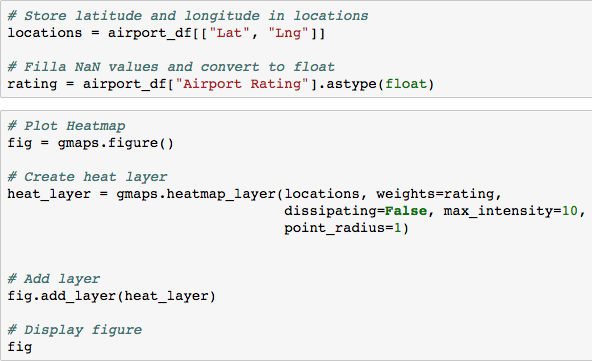

  * At minimum, two things are needed for a heatmap: locations and a weight. The `"Lat"` and `"Lng"` columns are pulled out for locations and the `bank rating` for the weight.

  * For the bonus, the arguments `dissipating=False`, `max_intensity=10`, and `point_radius=1` allow the map to handle being zoomed.

  * Finally, a gmap figure is created. Create the `heat_layer` by passing in locations and ratings, then the layer is added and the figure is displayed.

  * For the bonus, `map_type` can be changed by being passed in as a argument to `gmaps.figure()`

### 13. Instructor Do: Census Demo (0:10)

* (Note for Instructors: These census examples are definitely stretch targets. If you cannot get to it, don't sweat it!)

* As you transition to the next activity, explain to students that in the previous example all of the census data was provided to them. However, obtaining similar or other census data is fairly straightforward using the Python library census-wrapper.

* Have students visit the page [census-wrapper](https://github.com/datamade/census). Have them run `pip install census` and obtain a [Census API key](http://www.census.gov/developers/) from the US Census Bureau. To save time, you can simply provide students with your own key or the one included in the examples provided in this repository.

* Once students are set up, walk students through the general documentation of the census-wrapper API. In essence, the wrapper provides a fairly easy method of retrieving data from the 2013 census based on zip code, state, district, or county. Each census field (e.g. Poverty Count, Unemployment Count, Number of Asians, etc.) is denoted with a label like B201534_10E. In using the API, developers list out each of the desired fields based on their labels. The results are then returned as a list of dictionaries, which can be immediately converted into a DataFrame. (While discussing the API, it's fair to point out to students that the US Census API isn't the best documented API out there.)

* Then open the file [09-Ins_Census/Census_Demo.ipynb](Activities/08-Ins_Census/Solved/Census_Demo.ipynb) using Jupyter. Explain to students that this is the code used to create the csv in the banking deserts example. In particular, point out how:

  * We used the `c.acs5.get` method to grab data on each of the fields we needed. (Note: For ease of use a gist has been provided that explains what field each label in the US Census correlates with. We know. Your welcome.)

  * We divided the Poverty Count by Total Population to evaluate Poverty Rate. This is because the US census doesn't calculate Poverty Rate explicitly.

      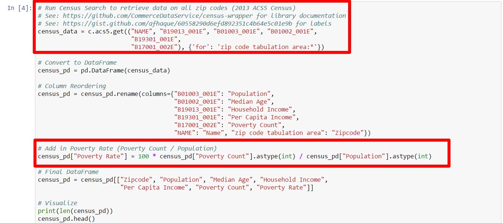

  * Ask if there are any questions before slacking out the code and proceeding with the activity.

### 14. Students Do: Census Activity (0:20)

* In this activity students will utilize the Census API to obtain census data at a state level and visualize it with gmaps.

* **Instructions:** [10-Stu_Census/README.md](Activities/09-Stu_Census/README.md)

  * Using [10-Stu_Census/Census_States.ipynb](Activities/09-Stu_Census/Unsolved/Census_States.ipynb) as a reference, create a completely new script that calculates each of the following fields at the **state** level:

    1. Population

    2. Median Age

    3. Household Income

    4. Per Capita Income

    5. Poverty Count

    6. Poverty Rate

    7. Unemployment Rate

  * Save the resulting data as a csv.

  * Next, read in the provided csv containing state centroid coordinates and merge this data with your original census data.

  * With the coordinates now appended to the dataframe, you have the ability to add markers to a base map, using the 'Poverty Rate' data to populate the info box.

* **Hints**

  * See documentation for the [Census API Wrapper](https://github.com/datamade/census).

  * See documentation for [Jupyter Gmaps](http://jupyter-gmaps.readthedocs.io/en/latest/tutorial.html) to learn how to add markers.

### 15. Instructor Do: Review Census Activity (0:05)

* Review the solution in [10-Stu_Census/Census_States.ipynb](Activities/09-Stu_Census/Solved/Census_States.ipynb) explaining the code as you go along:

  * Using the census API to add the code `B23025_005E` and `{for': 'state:*'}` to retrieve data at the state level and adding this to the columns dictionary. This allows for a deeper look at the data.

  * Calculating the unemployment rate by dividing unemployment count by state population.

  

  * Reading in the csv file containing state centroid coordinates and appending them to the dataframe enables plotting on the map; this is because gmaps requires a set of coordinates to map the data.

  * Converting the 'Poverty Rate' column to a list then looping through it allows gmaps to assign the poverty rate for each state to its corresponding marker.

  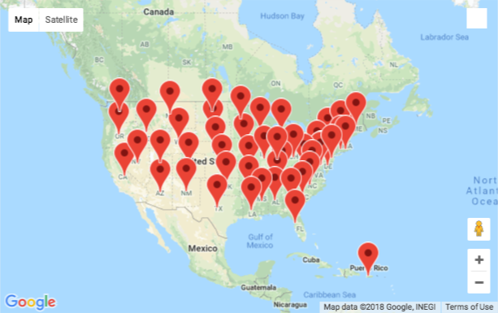

* Check if there are any questions before proceeding to slack out the solution.

### 16. Students Do: Banking Deserts Heatmap (0:18)

* Slack out the article on [banking deserts](https://www.theatlantic.com/business/archive/2016/03/banking-desert-ny-fed/473436/) from the Atlantic. Explain to students that "banking deserts" are a socioeconomic phenomenon in which many low-income and elderly areas tend to have no or few banking services available. The end-result is that these communities are often preyed upon by high-interest "check cashing" and "fast cash now" providers.

* Explain to students that they'll be creating a data visualization to understand how prominent the "banking desert" phenomenon truly is. In order to accomplish this, they will be utilizing the US Census and their newfound skills with the Google Geocoder API and Jupyter Gmaps.

* **Files:**

* [zip_bank_data.csv](Activities/10-Stu_BankDeserts_Heatmap/Resources/zip_bank_data.csv)

* [Unsolved/Banking_Deserts_HeatMap.ipynb](Activities/10-Stu_BankDeserts_Heatmap/Unsolved/Banking_Deserts_HeatMap.ipynb)

* **Instructions**

* In this activity your broad task is to answer the question: "What is the relationship between poverty, age, and population with the number of banks in a given area?" To help accomplish this task, you've been given census data for every zip code across the country.

* Using [zip_bank_data.csv](Activities/10-Stu_BankDeserts_Heatmap/Resources/zip_bank_data.csv) and your new knowledge of the US Census API, add a column for Unemployment Rate to the csv.

* Using `gmap` create the following three figures:

  * A map with a `heatmap_layer` of the poverty rate for each city.

  * A map with a `symbol_layer` for the number of banks located at that city.

  * A map that includes both the poverty `heatmap_layer` and the bank `symbol_layer`.

* **Hints**

* Test your code with only 5-10 cities at a time while debugging.

* For reference, use the docs for the [layers](http://jupyter-gmaps.readthedocs.io/en/latest/api.html#figures-and-layers) and as a [refresher](http://jupyter-gmaps.readthedocs.io/en/latest/tutorial.html) for setting up the maps.

* Be sure to handle zoom on the heatmap.

* At this point, you should not need to perform any new requests to Google's APIs.

* To format the info boxes on your `symbol_layer`, look to use string formatting with list comprehension.

### 17. Instructor Do: Review Banking Deserts Heatmap (0:10)

* Open [11-Stu_BankDeserts_Unemployment/Solved/Banking_Desert_HeatMap.ipynb](Activities/10-Stu_BankDeserts_Heatmap/Solved/Banking_Desert_HeatMap.ipynb) in jupyter notebook and go through the code. Along the way be sure to explain:

  * Find the unemployment rate by dividing the `Unemployment Count` by `Population`. Be sure to that each column is converted to an integer.

  * Create a new census dataframe  by selecting  "Zipcode", "Population", and "Unemployment Rate".

  * Combine the data by loading "zip_bank_data.csv" into a dataframe and merge on  **Zipcode** with the census dataframe that was just created.

    

  * Configure `gmaps` by adding in an API key.

  * Grab the "Lat" and "Lng" to be stored as the locations that will be used in the heatmap. "Poverty Rate" will be used as the weight on the heatmap. Both these values will need to convert into floats.

  * A `heatmap_layer` is then created, added to the figure and displayed. Be sure to pass the arguments that handle the map dissipating when zoomed.

    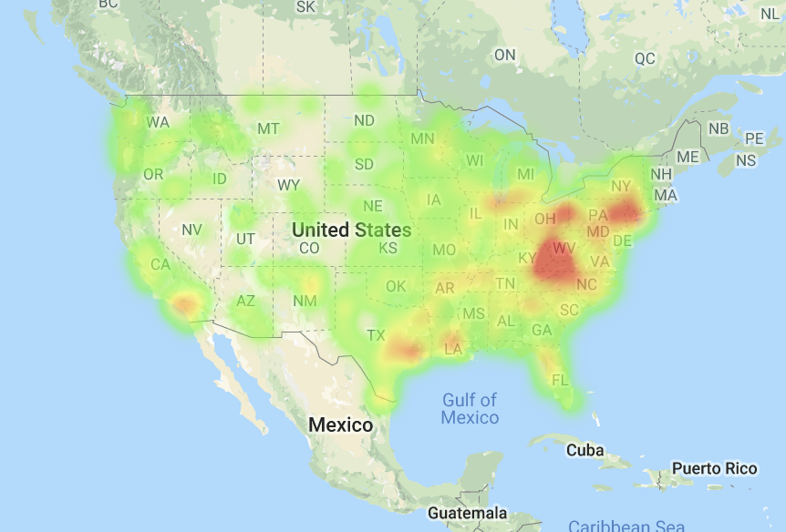

  * "Bank Rate" is converted to a list in order to be passed in as `info_box_content` to the `symbol_layer`.

  * A symbol layer is created by passing in locations and "Bank Rate". The additional arguments are stylistic and can adjusted to help clear up how the map will look. The list comprehension `f"Bank amount: {bank}" for bank in bank_rate` will allow the bank data to be customized and added to the map. Finally the `symbol_layer` is added to the figure and displayed.

    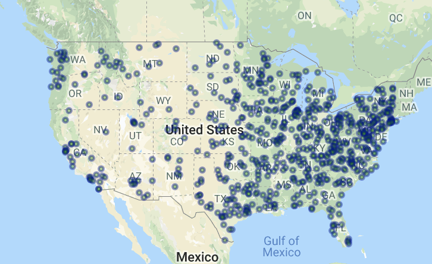

  * For the last steps, a new map is created by adding both the `heatmap_layer` and the `symbol_layer` before displaying the figure.

    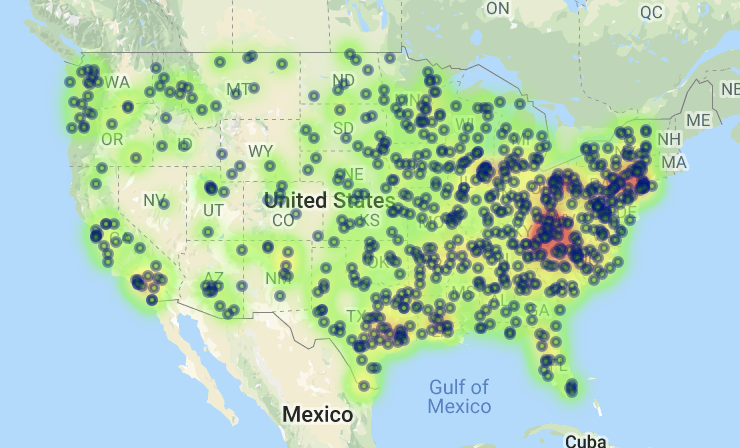

### 18. Instructor Do: Video Guide and Close Class (0:02)

* Before finishing up for the night, slack out the [Video Guide](../VideoGuide.md) containing walkthroughs of this week's key activities. Encourage students to review them later and utilize office hours if they have further questions.

- - -

### LessonPlan & Slideshow Instructor Feedback

* Please click the link which best represents your overall feeling regarding today's class. It will link you to a form which allows you to submit additional (optional) feedback.

* [:heart_eyes: Great](https://www.surveygizmo.com/s3/4381674/DataViz-Instructor-Feedback?section=6.3&lp_useful=great)

* [:grinning: Like](https://www.surveygizmo.com/s3/4381674/DataViz-Instructor-Feedback?section=6.3&lp_useful=like)

* [:neutral_face: Neutral](https://www.surveygizmo.com/s3/4381674/DataViz-Instructor-Feedback?section=6.3&lp_useful=neutral)

* [:confounded: Dislike](https://www.surveygizmo.com/s3/4381674/DataViz-Instructor-Feedback?section=6.3&lp_useful=dislike)

* [:triumph: Not Great](https://www.surveygizmo.com/s3/4381674/DataViz-Instructor-Feedback?section=6.3&lp_useful=not%great)

- - -

### Copyright

Trilogy Education Services © 2018. All Rights Reserved.
